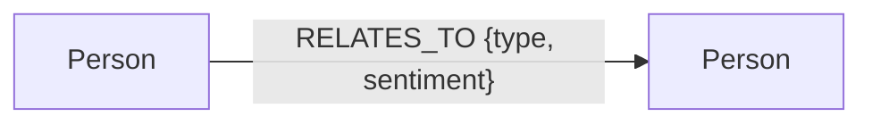

# 🧬 Graph-Relational AI Agent Dashboard

A premium graph-relational visualization and query dashboard that maps human connections in **FalkorDB** and explores them using an autonomous AI Agent built on the **Google Antigravity SDK**.

---

## 1. System Architecture

The application is structured into a 3-tier topology linking the user interface, the graph database, and the autonomous AI agent:

```
┌────────────────────────────────────────────────────────┐
│                      Client UI                         │
│             (Streamlit Web Application)                │
└───────────┬───────────────────────────────▲────────────┘
            │                               │
            │ 1. Submit Person Data         │ 4. Render Results
            ▼                               │
            ┌───────────────────────────────┴────────────────────────┐
            │                  Python Backend Engine                 │
            │         (FalkorDB Client & Agent Interface)            │
            └───────────┬───────────────────────────────▲────────────┘
                        │                               │
                        │ 2. Cypher Queries             │ 3. Schema & Data
                        ▼                               │
            ┌──────────────────────────────┐ ┌──────────┴────────────┐
            │          FalkorDB            │ │   Google GenAI Agent  │
            │      (Docker Instance)       │ │  (NL to Cypher Tool)  │
            └──────────────────────────────┘ └───────────────────────┘
```

*   **Data Tier**: FalkorDB (Redis-compatible, high-performance graph database) running inside Docker.
*   **Application Tier**: A Streamlit dashboard utilizing custom CSS glassmorphism components to capture entity relations and prompt natural language questions.
*   **Agent Tier**: A Google Antigravity SDK Agent that automatically converts natural language questions to Cypher queries, retrieves results, and synthesizes answers.

---

## 2. Database Schema (Graph Model)

The graph database schema is modeled with a single node label (`Person`) and a single directed relationship type (`RELATES_TO`).



### Nodes (`Person`)
Represent individuals in the network.
* **Label**: `Person`
* **Properties**:
  * `name` (String): The unique name/identifier of the person.
  * `location` (String): The geographical location of the person.

### Relationships (`RELATES_TO`)
Directed edges representing how one person views or interacts with another.
* **Type**: `RELATES_TO`
* **Properties**:
  * `type` (String): The category of relationship (e.g., `friend`, `spouse`, `boss`, `employee`, `sibling`, `enemy`, `colleague`, `partner`, `other`).
  * `sentiment` (String): The emotional level of the relationship (e.g., `hate`, `dislike`, `neutral`, `like`, `love`).

---

## 3. Tech Stack & Dependencies

*   **Backend & Ingestion**: Python 3.11+ / Streamlit 1.58
*   **Graph Database**: FalkorDB (via Docker image `falkordb/falkordb:latest`)
*   **AI Agent Framework**: Google Antigravity SDK (`google-antigravity==0.1.3`)
*   **Validation**: Pydantic v2

---

## 4. Installation & Configuration

### Prerequisites
*   Docker & Docker Compose installed.
*   Python 3.11+ installed.
*   A Gemini API Key (obtained from [Google AI Studio](https://aistudio.google.com/app/api-keys)).

### Setup Instructions

1.  **Clone the repository and navigate into it:**
    ```bash
    cd relation_db
    ```

2.  **Create and activate a virtual environment:**
    ```bash
    python -m venv .venv
    source .venv/bin/activate
    ```

3.  **Install dependencies:**
    ```bash
    pip install -r requirements.txt
    ```

4.  **Configure Environment Variables:**
    Create a `.env` file in the root directory:
    ```ini
    # Gemini API Credentials
    GOOGLE_API_KEY=your_gemini_api_key_here
    
    # FalkorDB Credentials
    FALKORDB_HOST=localhost
    FALKORDB_PORT=6379
    GRAPH_NAME=relationships_graph
    ```

5.  **Start FalkorDB Instance:**
    Spin up the graph database container in detached mode:
    ```bash
    docker compose up -d
    ```

---

## 5. How to Run

### Run Unit Tests
To verify graph database operations and make sure connections are active, execute the test suite:
```bash
pytest
```

### Start the Streamlit Application
Launch the visual web dashboard:
```bash
streamlit run src/app.py
```
This runs the dashboard locally. Open the provided URL (e.g., `http://localhost:8502`) in your browser to view the interface.

### Query the AI Agent via CLI
You can also run the Natural Language query interface directly from your terminal:
```bash
python src/agent.py --query "Who is enemies with Alice?"
```

---

## 6. Directory Structure

```
├── .env                  # Environment configuration
├── docker-compose.yml    # Docker setup for FalkorDB
├── requirements.txt      # Project library dependencies
├── src/
│   ├── app.py            # Streamlit dashboard layout and frontend controller
│   ├── agent.py          # Google Antigravity agent & NL translation tool
│   └── database.py       # FalkorDB client query and ingestion manager
└── tests/
    └── test_database.py  # Automated integration tests
```
